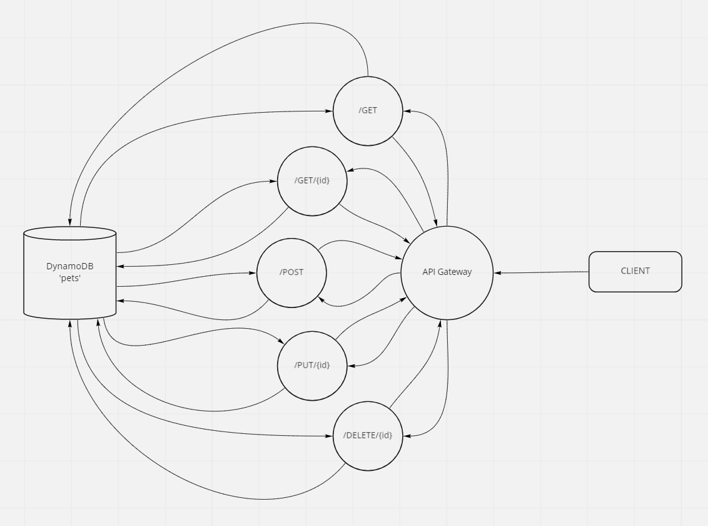

# Serverless-API
---

## Overview

Create a single resource REST API using a domain model of your choosing, constructed using AWS Cloud Services.

## Author: William Moreno

## Collaborators

- James Gerstenberger
- Nick Abramowicz
- Jason Quaglia
- Carly Dekock
- Jason Dormier

## Getting Started

The API Gateway can be found here:

[Pets Database API Gateway](https://aok7i852b5.execute-api.us-west-2.amazonaws.com/beta)

The '/' route has no method currently.

## Features

- A DynamoDB with the table 'pets'
- A API Gateway 'pets-api'
- 4 Lambda functions
  - `create-pets` - POST on the /pets route, requires { name, type }. Creates a pet and places it in the 'pets' table.
    - returns the record created
  - `read-pets` - GET on either /pets or /pets/{id} route. Can be tried once with { id: '001' }. if provided an id returns the matching pet from the table. If there is no match or an id is not included, the contents of the table will be displayed.
    - returns either the specific record requested or a list of all records in the database
  - `update-pets` - PUT on the /pets/{id} route, requires { name **and/or* type } and can be tried once with { id: '293' }. Locates the matching record in the table and updates either the name, the type or both depending on what is provided.
    - returns the updated record
  - `remove-pets` - DELETE on the /pets/{id} route. Removes the record with the provided id from the 'pets' table. Can be attempted only once with either { id: '001' } or { id: '293' }
    - returns no data

## Process

Database and API Gateway were created first. Lambda functions were created, zipped and uploaded. Using AWS management console, roles and permissions were assigned and routes were created and assigned lambda functions. Lambda functions with given permissions needed to interact with the DynamoDB. API Gateway was then deployed.

A test suite was written to verify functionality of the api routes and is included.

*Be sure to clone the repository and then `npm install` in the terminal in order to run the tests*

## UML

UML drawing created with [miro](https://miro.com/)

